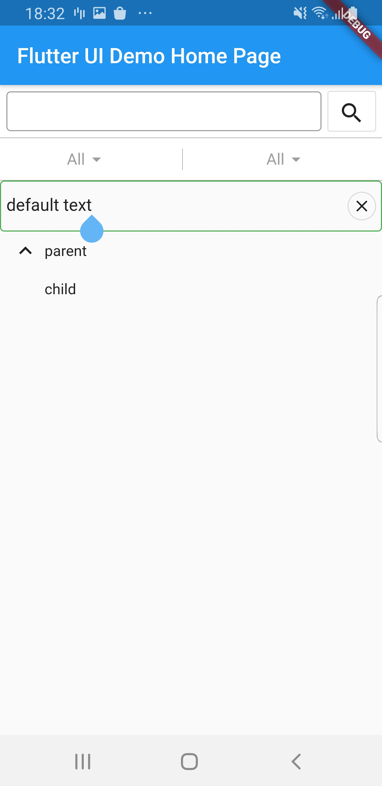
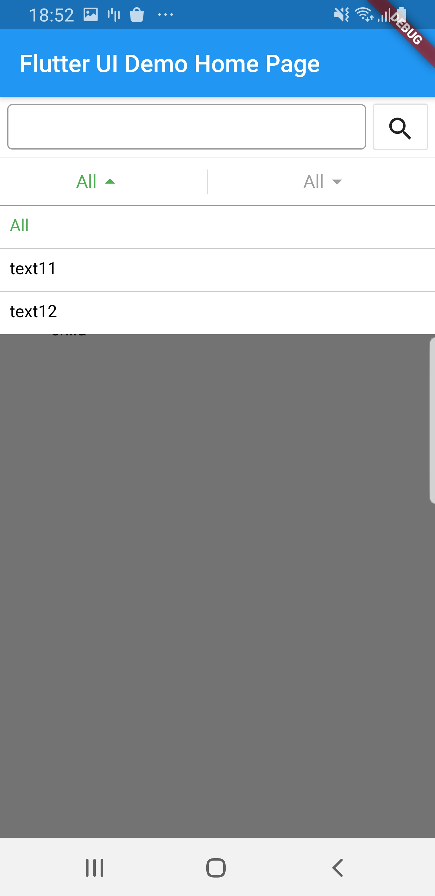

# Flutter-ui
 Useful and awesome flutter widgets

- - -
# Usage

**EditText**

``` dart
Widget _buildEditText() {
	// there are many other params
    return EditText(
      defaultText: 'default text',
      outline: true,
    );
  }
```

**SearchBar**

``` dart
Widget _buildSearchBar() {
    // there are many other params
    return SearchBar((String searchText) {});
  }
```

**TreeNode**

``` dart
Widget _buildTreeView() {
    // there are many other params
    return TreeNode(
      expand: true,
      title: Text('parent'),
      children: [
        TreeNode(
          title: Text('child'),
        ),
      ],
    );
  }
```

**FilterMenu**

``` dart
Widget _buidListView(List<Widget> widgets) {
    return ListView.builder(
      shrinkWrap: true,
      itemBuilder: (context, index) => widgets[index],
      itemCount: widgets.length,
    );
  }

Widget _buildFilterMenu() {
    final data = [
      ['All', 'text11', 'text12'],
      ['All', 'text21', 'text22'],
    ];
    // there are many other params
    return FilterMenu(
      initialHeader: data.map((menu) => menu[0]).toList(),
      menuItemCountGetter: (menuIndex) => data[menuIndex].length,
      menuItemBuilder: (context, menuIndex, menuItemIndex, highlight) =>
          Container(
        padding: EdgeInsets.all(8),
        height: 35,
        child: Text(
          data[menuIndex][menuItemIndex],
          style: TextStyle(
            color: highlight ? Colors.green : Colors.black,
          ),
        ),
      ),
      menuItemTextGetter: (menuIndex, menuItemIndex) =>
          data[menuIndex][menuItemIndex],
      onMenuItemSelected: (menuIndex, menuItemText) => VoidCallback,
      overlap: _buidListView([_buildEditText(), _buildTreeView()]),
    );
  }
```

- - -


- - -

MIT License

Copyright (c) 2021 hcq0618

Permission is hereby granted, free of charge, to any person obtaining a copy
of this software and associated documentation files (the "Software"), to deal
in the Software without restriction, including without limitation the rights
to use, copy, modify, merge, publish, distribute, sublicense, and/or sell
copies of the Software, and to permit persons to whom the Software is
furnished to do so, subject to the following conditions:

The above copyright notice and this permission notice shall be included in all
copies or substantial portions of the Software.

THE SOFTWARE IS PROVIDED "AS IS", WITHOUT WARRANTY OF ANY KIND, EXPRESS OR
IMPLIED, INCLUDING BUT NOT LIMITED TO THE WARRANTIES OF MERCHANTABILITY,
FITNESS FOR A PARTICULAR PURPOSE AND NONINFRINGEMENT. IN NO EVENT SHALL THE
AUTHORS OR COPYRIGHT HOLDERS BE LIABLE FOR ANY CLAIM, DAMAGES OR OTHER
LIABILITY, WHETHER IN AN ACTION OF CONTRACT, TORT OR OTHERWISE, ARISING FROM,
OUT OF OR IN CONNECTION WITH THE SOFTWARE OR THE USE OR OTHER DEALINGS IN THE
SOFTWARE.

